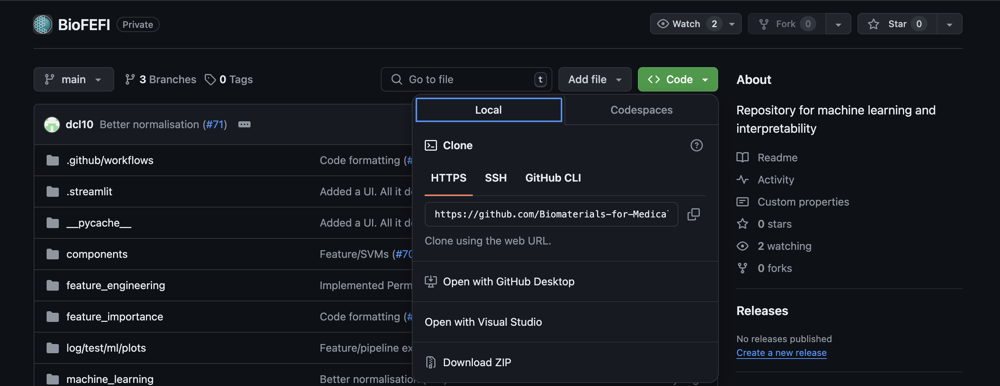
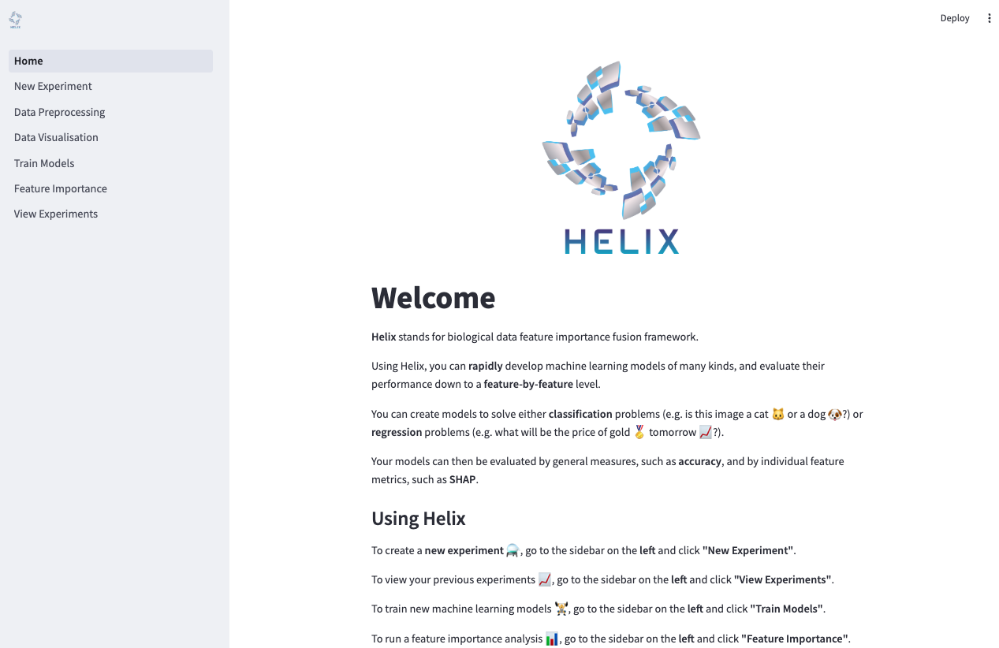

# BioFEFI: Python Toolkit for Machine Learning, Feature Importance, and Fuzzy Interpretation

## Overview

This toolkit provides a streamlined workflow for machine learning model training, feature importance analysis, and fuzzy interpretation. It includes pipelines for data ingestion, model training, feature importance evaluation, and fuzzy logic rule generation.

**Note**: The data used in this pipeline needs to be pre-cleaned and pre-modeled. This includes:
- Data type formatting
- Missing values resolved
- Outliers removed
- Feature engineering completed

The data should be in a format where all columns except the last one are input features, and the last column is the target variable.

## Installation

You can obtain a copy of the latest code by downloading it from Github. You can do this by donwloading the ZIP file using the button shown below:


Or by using the git command in the terminal:
```bash
git clone https://github.com/Biomaterials-for-Medical-Devices-AI/BioFEFI.git
```

You then need to set up a Python virtual environment. In the `BioFEFI` directory that you downloaded, use the following command in the terminal:

For MacOS / Linux
```shell
# create a virtual environment
python -m venv .venv

# activate the virtual environment
source .venv/bin/activate

# add poetry to the virtual environment
pip install poetry

# install the code and its dependencies in the virtual environment
poetry install
```

For Windows
```shell
# create a virtual environment
python -m venv .venv

# activate the virtual environment
source .venv\Scripts\activate

# add poetry to the virtual environment
pip install poetry

# install the code and its dependencies in the virtual environment
poetry install
```

**NB:** if `python` doesn't work, try using `python3` instead.

## Running the app

If everything the installation was successful, you should be able to run the app. In the `BioFEFI` directory run the following command:

```bash
streamlit run ui.py
```

Remember to activate the virtual environment before running the app, if you haven't already (see [Installation](#installation)). The app will open in your web browser. Or you can follow follow this link to view your app http://localhost:8501.

You will see the following screen:


## Usage

### Overview

On the left hand side of the screen, you will see the options for running the `BioFEFI` toolkit. By default it will train new machine learning models, but you can uncheck the checkbox that says "Train new models" and a new field will appear on the "Data Upload" form which will allow you to upload your own models. These models must be compatible with [scikit-learn](https://scikit-learn.org/stable/index.html). 

When training new models, you may select the "Feature Importance" checkbox and configure how to evaluate feature importance once the new models are trained.
If you choose to upload your own models, click the "Feature Importance" checkbox in order to evaluate your models.

Under "Feature Importance" there is a checkbox called "Fuzzy feature selection". Check this box to configure fuzzy feature selection.

On the "Data Upload" form, there are 3 fields, or 4 if you choose not to train new models. In the first field, you will enter the name of your experiment. Enter the name of the dependent variable in the second field. This will tell `BioFEFI` what to put on the plots in the output - the last (rightmost) column is used as the dependent varaible when actually running the pipeline. The third column is where you upload your training data, in the form of a CSV (`.csv`) file. If you unchecked the "Train new models" checkbox, the fourth field lets you upload multiple machine learning models as pickled objects (`.pkl`) (https://scikit-learn.org/stable/model_persistence.html#pickle-joblib-and-cloudpickle).

When you're happy with your input and configuration, press "Run" to start the pipeline. A "Cancel" button will appear underneath which will allow you stop the run at any point. A spinner will appear under the buttons to show the pipeline is working. Once complete, logs for the latest run of your experiment will appear and so will any plots generated.

### Finding your outputs
Currently by default, `BioFEFI` saves all outputs to your home directory under the `.BioFEFI` directory. On Linux this path looks like: `/home/myuser/.BioFEFI`, on MacOS, `/Users/myuser/.BioFEFI` and on Windows `C:\\Users\myuser\.BioFEFI`.

In this directory you will find subdirectories named after your experiments. Within each experiment, you will find:
- the training data
- a subdirectory called `logs`
- a subdirectory called `plots`

To change the directory to save all the outputs, run the app using the following command:
```bash
BASE_DIR=<insert desired path here> streamlit run ui.py
```

### Training new models
Click the box that says "Machine Learning Options" under the "Train new models" checkbox to reveal the options for training new models.

First you will select whether your problem is a Classification or a Regression problem. There are 4 model types currently available in `BioFEFI` with a classifier and regressor variant for each:

- Linear models
  - LogisticRegression (classifier)
  - LinearRegression (regressor)
- Random Forest models
  - RandomForestClassifier (classifier)
  - RandomForestRegressor (regressor)
- XGBoost models
  - XGBClassifier (classifier)
  - XGBRegressor (regressor)
- Support Vector Machine (SVM) models
  - SVC (classifier)
  - SVR (regressor)

You may leave all model types checked (they're on by default), or you can uncheck the model types you don't want. For each model type, there are some hyperparameters which you can alter. For the explanations of the hyperparameters see the following links:

- [LogisticRegression](https://scikit-learn.org/stable/modules/generated/sklearn.linear_model.LogisticRegression.html)
- [LinearRegression](https://scikit-learn.org/stable/modules/generated/sklearn.linear_model.LinearRegression.html)
- [RandomForestClassifier](https://scikit-learn.org/stable/modules/generated/sklearn.ensemble.RandomForestClassifier.html)
- [RandomForestRegressor](https://scikit-learn.org/stable/modules/generated/sklearn.ensemble.RandomForestRegressor.html)
- [XGBClassifier](https://xgboost.readthedocs.io/en/stable/python/python_api.html#xgboost.XGBClassifier)
- [XGBRegressor](https://xgboost.readthedocs.io/en/stable/python/python_api.html#xgboost.XGBRegressor)
- [SVC](https://scikit-learn.org/stable/modules/generated/sklearn.svm.SVC.html)
- [SVR](https://scikit-learn.org/stable/modules/generated/sklearn.svm.SVR.html)

Next you can select the method of normalisation. The current choices are:
- [Standardization](https://scikit-learn.org/stable/modules/generated/sklearn.preprocessing.StandardScaler.html)
- [MinMax](https://scikit-learn.org/stable/modules/generated/sklearn.preprocessing.MinMaxScaler.html)
- None

You can then set the holdout size, a fraction between 0 and 1 to reserve some of the training data for testing the models.

And finally, choose a number of bootstraps. The pipeline generate a model for each bootstrap. If you have more than one model type configured, the pipeline will train `m * n` models, where `m` is the number of selected model types and `n` is the number of bootstraps.