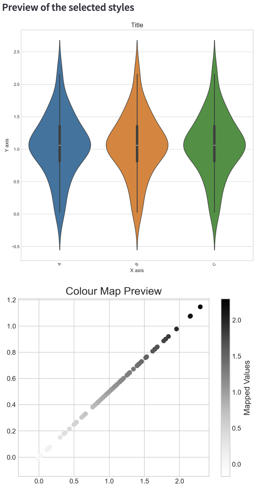

# Creating an experiment

In Helix, you must create an experiment before you can train models and perform feature importance analyses. To do this, navigate to the **"New Experiment"** page by clicking the link on the left hand side of the screen.

## Create a new experiment
- Choose a name for your experiment. You can see from the image below that there is a file path in front of the text box where you enter your experiment's name. Your experiment will be saved to this path under a folder with the same name as the one you entered into the text box.

  If you already have an experiment saved with the same name as the one you have entered, you will not be able to create the experiment.

- Choose your data with which to train your models. The file must be in **CSV** or **XLSX** format.

- Give a name to your dependent variable. This will be displayed on any plots generated by your experiment.

- Select your problem type.

    If your dependent variable is categorical (e.g. cat 🐱 or dog 🐶), choose **"Classification"**.

    If your dependent variable is continuous (e.g. stock prices 📈), choose **"Regression"**.

- Specify the random seed. This setting helps make an experiment repeatable.

## Configure experiment plots
- Save all plots. **On by default**. Sometimes you may not want the plots, but you can produce them for publications, presentations, reports, etc.

- Width. Sets the width of your plots.

- Height. Sets the height of your plots.

- Image Resolution (DPI). Sets the resolution of your plots in dots-per-inch (DPI).

- Angle to rotate X-axis labels. Rotate X-axis labels for better legibility. Defaults to 10 degrees.

- Angle to rotate Y-axis labels. Rotate Y-axis labels for better legibility. Defaults to 60 degrees.

- Title font size. Defaults to 20px.

- Axis font size. Defaults to 8px.

- Axis tick size. Defaults to 8px.

- Colour scheme. Defaults to "Solarize_Light2".

  Options:
  - Solarize_Light2
  - _classic_test_patch
  - _mpl-gallery
  - _mpl-gallery-nogrid
  - bmh
  - classic
  - dark_background
  - fast
  - fivethirtyeight
  - ggplot
  - grayscale
  - seaborn-v0_8
  - seaborn-v0_8-bright
  - seaborn-v0_8-colorblind
  - seaborn-v0_8-dark
  - seaborn-v0_8-dark-palette
  - seaborn-v0_8-darkgrid
  - seaborn-v0_8-deep
  - seaborn-v0_8-muted
  - seaborn-v0_8-notebook
  - seaborn-v0_8-paper
  - seaborn-v0_8-pastel
  - seaborn-v0_8-poster
  - seaborn-v0_8-talk
  - seaborn-v0_8-ticks
  - seaborn-v0_8-white
  - seaborn-v0_8-whitegrid
  - tableau-colorblind10

- Colour map. Defaults to "viridis"

  Options:
  - The list is very long but the full reference can be viewed [here](https://matplotlib.org/stable/gallery/color/colormap_reference.html).

- Font. Defaults to "sans-serif".

  Options:
  - serif
  - sans-serif
  - cursive
  - fantasy
  - monospace

## Press Create
Once you're happy with your experiment set-up, press the **"Create"** button and your experiment configurations will be saved, ready to be used to train models and run feature importance analyses.