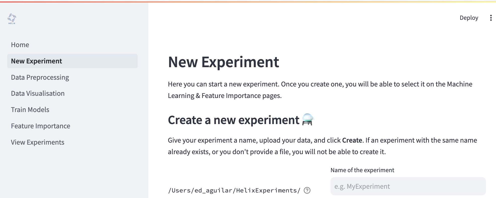

# Creating an experiment

In BioFEFI, you must create an experiment before you can train models and perform feature importance analyses. To do this, navigate to the **"New Experiment"** page by clicking the link on the left hand side of the screen.

## Create a new experiment
- Choose a name for your experiment. You can see from the image below that there is a file path in front of the text box where you enter your experiment's name. Your experiment will be save to at this path under a folder with the same name as the one you entered into the text box.

  If you already have an experiment saved with the same name as the one you have entered, you will not be able to create the experiment.

- Choose your data to train your with which to train your models. The file must be in CSV format.

- Give a name to your dependent variable. This will be displayed on any plots generated by your experiment.

## Configure data options
### Automatic hyper-parameter search
BioFEFI allows you to either manually set hyper-parameters for your models or perform an automatic hyper-parameter search. This is performed by [Grid Search with cross-validation](https://scikit-learn.org/stable/modules/grid_search.html#exhaustive-grid-search). When performing automatic hyper-parameter search, the data will not be bootstrapped and you will get the best performing model from the search for each model. By default, BioFEFI will perform automatic hyper-parameter search; to manually tune your models, click the toggle to switch to manual mode.

### Options

- Select your problem type.

    If your dependent variable is categorical (e.g. cat 🐱 or dog 🐶), choose **"Classification"**.

    If your dependent variable is continuous (e.g. stock prices 📈), choose **"Regression"**.

- Select how you wish to normalise your data.

    If you select **"Standardization"**, your data will be normalised by subtracting the mean and dividing by the standard deviation for each feature. The resulting transformation has a mean of 0 and values are between -1 and 1.

    If you select **"Minmax"**, your data will be scaled based on the minimum and maximum value of each feature. The resulting transformation will have values between 0 and 1.

    If you select **"None"**, the data will not be normalised.

- Select your data split method

    **"Holdout"** will create a train-test split with a portion of the data randomly held out to test the model, which will be trained on the remaining portion of the data.

    **"K-fold"** stands for *K-fold cross validation*. The test data is split from the training data, then the training data is split into *k*-folds. The folds are used to find the model parameters and the test set is used to evaluate the models.

- Specify a test split size. This is a number between 0 and 1. The default is 0.20, i.e. 20% of the data will be used is the test data and 80% for training.

- Specify the number of bootstraps. This will train a model *n* times, where *n* is the number of bootstraps. The data will be randomly split *n* times into new bataches of training and testing sets. Defaults to 10.

- Specify the random seed. Data splitting is pseudo-random and this setting helps make an experiment repeatable, while reducing bias in the training and testing sets.

## Configure experiment plots
- Save all plots. Defaults to `True`. Sometimes you may not want the plots, but you can produce them for publications, presentations, reports, etc.

- Angle to rotate X-axis labels. Rotate X-axis labels for better legibility. Defaults to 10 degrees.

- Angle to rotate Y-axis labels. Rotate Y-axis labels for better legibility. Defaults to 60 degrees.

- Title font size. Defaults to 20px.

- Axis font size. Defaults to 8px.

- Axis tick size. Defaults to 8px.

- Colour scheme. Defaults to "Solarize_Light2".

  Options:
  - Solarize_Light2
  - _classic_test_patch
  - _mpl-gallery
  - _mpl-gallery-nogrid
  - bmh
  - classic
  - dark_background
  - fast
  - fivethirtyeight
  - ggplot
  - grayscale
  - seaborn-v0_8
  - seaborn-v0_8-bright
  - seaborn-v0_8-colorblind
  - seaborn-v0_8-dark
  - seaborn-v0_8-dark-palette
  - seaborn-v0_8-darkgrid
  - seaborn-v0_8-deep
  - seaborn-v0_8-muted
  - seaborn-v0_8-notebook
  - seaborn-v0_8-paper
  - seaborn-v0_8-pastel
  - seaborn-v0_8-poster
  - seaborn-v0_8-talk
  - seaborn-v0_8-ticks
  - seaborn-v0_8-white
  - seaborn-v0_8-whitegrid
  - tableau-colorblind10

- Font. Defaults to "sans-serif".

  Options:
  - serif
  - sans-serif
  - cursive
  - fantasy
  - monospace

## Press Create
Once you're happy with your experiment set-up, press the **"Create"** button and your experiment configurations will be saved, ready to be used to train models and run feature importance analyses.