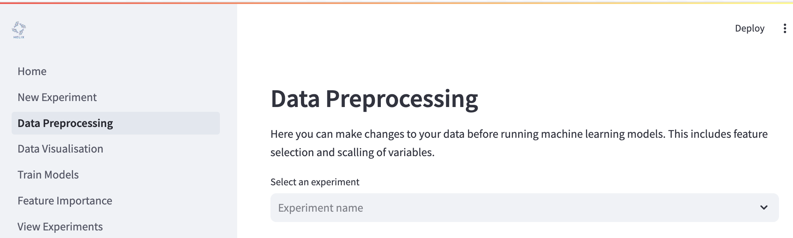

# Preprocessing your data
Helix allows you preprocess your data before training any models. This includes normalising your data, removing low variance features or highly correlated features.

## Normalisation
- Normalisation Method for Independent Variables

    If you select **"Standardization"**, your independent variables will be normalised by subtracting the mean and dividing by the standard deviation for each feature. The resulting transformation has a mean of 0 and values are between -1 and 1.

    If you select **"Minmax"**, your independent variables will be scaled based on the minimum and maximum value of each feature. The resulting transformation will have values between 0 and 1.

    If you select **"None"**, the data will not be normalised.

- Transformation Method for Dependent Variable

    If you select **Log**, the dependent variable will transformed with the natural logarithm (`ln` / `log e`). If the minimum of your dependent variable is less than or equal to 0, it is first transformed by `(y - min(y)) + 1` to make all values positive, followed by the natural logarithm.

    If you select **Square-root**, the dependent variable is transformed by taking the sqare root of each value. If the minimum of your dependent variable is less than 0, it is first transformed by `y - min(y)` to make all values at least 0, followed by the square root.

    If you select **"Minmax"**, your dependent variable will be scaled based on the minimum and maximum value of each feature. The resulting transformation will have values between 0 and 1.

    If you select **"Standardization"**, your dependent variable will be normalised by subtracting the mean and dividing by the standard deviation for each feature. The resulting transformation has a mean of 0 and values are between -1 and 1.

## Feature selection
- Remove low variance features

    To remove features with low variance, click the checkbox labelled **"Variance threshold"**, then adjust the threshold between 0 and 1. **(Default: 0.10)**

- Remove highly correlated features

    To remove features that are highly correlated with one another, click the checkbox labelled **"Correlation threshold"**, then adjust the threshold between 0 and 1. **(Default: 0.80)**

- Lasso feature selection

    Select features using the [Lasso algorith](https://en.wikipedia.org/wiki/Lasso_(statistics)). Click the checkbox labelled **"Lasso Feature Selection"** then set the regularisation term which be **non-negative**. **(Default: 0.05)**

## Run feature selection
Once you have configured your preprocessing measures, click **"Run Data Preprocessing"**. You will see a summary of your preprocessed data below.

After preprocessing is completed, a copy of your preprocessed data is save to your experiment with the name `<data file>_preprocessed.csv`. E.g. `BacterialAttachment.csv` would produce a file called `BacterialAttachment_preprocessed.csv`. This data will be used for model training, feature importance.

