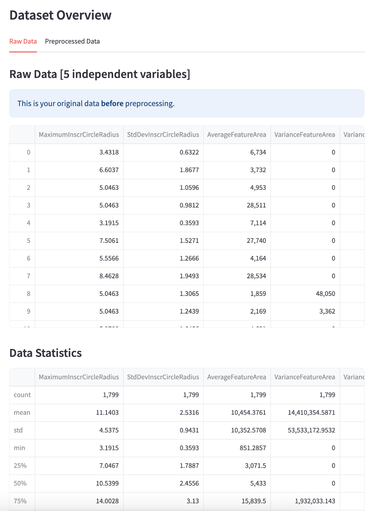
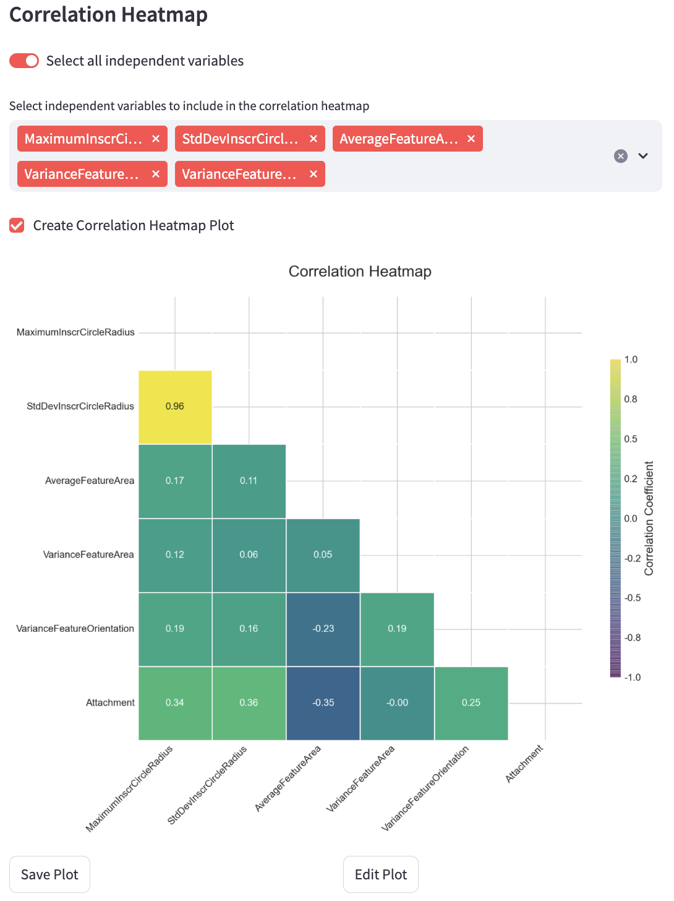
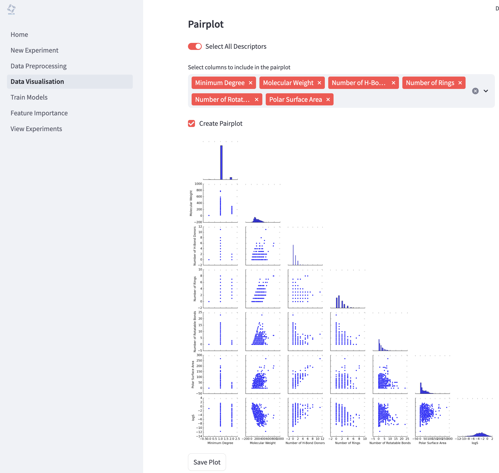

# Data Visualisation
The **Data Visualisation** page allows you to explore and analyse your data using a variety of visual tools. This helps in understanding data distributions, correlations, and feature interactions.

To begin, select your experiment from the dropdown menu where it says **"Select an experiment"**. This will load the dataset associated with your selected experiment.

## Dataset Overview
The dataset overview gives you a snapshot of how your data look. This is split into two tabs: one showing the **Raw Data** data (i.e. how it looked before preprocessing) and one showing the **Preprocessed Data** (i.e. how the data are after preprocessing). The overview also includes a normality test for each variable in the dataset (independent and dependent). Normality is determined by two statistical tests: the Shapiro-Wilk and the Kolmogorov-Smirnov test. If the p-value < 0.05, the data is likely not normally distributed. If the p-value ≥ 0.05, the data might be normally distributed.

## Target Variable Distribution
Visualise the distribution of your target variable using histograms and KDE (Kernel Density Estimation).

- **Show KDE**: Toggle to include a KDE curve.
- **Number of Bins**: Adjust the number of bins in the histogram.

## Correlation Heatmap
Display a heatmap showing correlations between selected features.

- **Select All Descriptors**: Include all features in the heatmap.
- **Select Columns**: Manually select specific features for the heatmap.

## Pairplot
Generate pairwise scatter plots for selected features to identify trends and interactions.

- **Select All Descriptors**: Include all features in the pairplot.
- **Select Columns**: Manually select specific features for pairplot generation.

## t-SNE Plot
Visualise high-dimensional data in two dimensions using t-SNE.

## Saving Visualisations
You can save generated plots to disk for reporting or further analysis. To save a plot, click the **"Save Plot"** button beneath each plot. You can also edit each plot individually by clicking the **"Edit Plot"** button beneath each plot and changing the settings in the panel.

## How to Start
1. Select an experiment.
2. Choose the visualisation type.
3. Adjust parameters as needed.
4. Click the buttons to generate and save visualisations.

Press **"Create and Save"** to save plots for further use.
