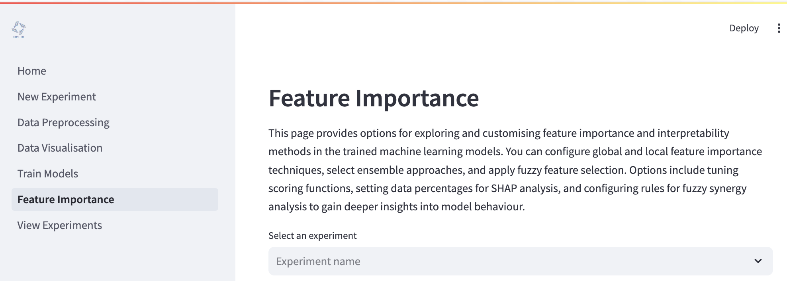
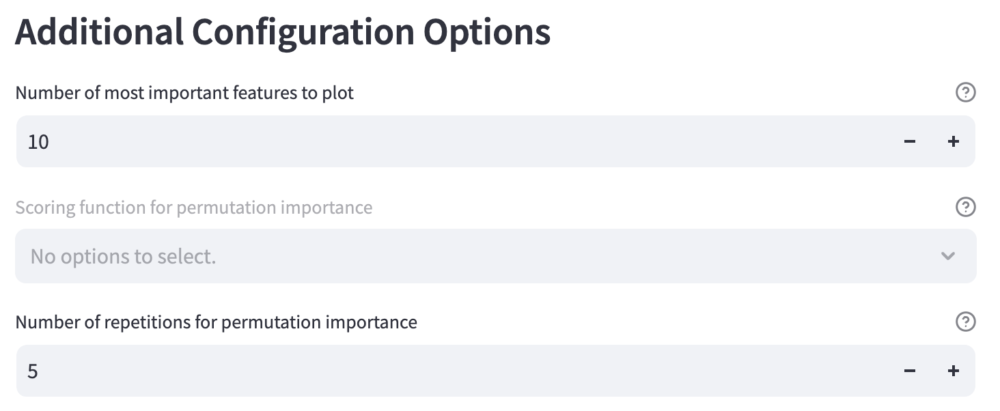

# Feature importance
Once you have trained some models in your experiment, you can then perform feature importance analyses to assess which features more most influential in the models' decision making. You can get to the Feature Importance page by clinking on **Feature Importance** on the left hand side of the page.

To begin explaining your models, you can click the **"Explain all models"** toggle and have all your models evaluated...

...or you can use the dropdown menu to select specific models to evaluate.

## Global feature importance methods
These methods evaluate the influence of individual features overall on a model's decisions. There are two methods available.

- [Permutative importance](https://scikit-learn.org/1.5/modules/permutation_importance.html)
  
- [SHAP (<u>SH</u>apely <u>A</u>dditive ex<u>P</u>lanations)](https://www.datacamp.com/tutorial/introduction-to-shap-values-machine-learning-interpretability)

## Ensemble feature importance methods
Ensemble methods combine results from multiple feature importance techniques, enhancing robustness. To use ensemble methods, you must configure at least one global importance method. There are two methods available.

- Mean

  Use the mean of importance estimates from the selected global methods.
- Majority vote

  Take the majority vote of importance estimates from the selected global methods.

## Local feature importance methods
These methods are used to interpret feature importance on a *per prediction* basis. You can see which features had the most influence - and in which direction - on each prediction. There are two methods available.

- [LIME (<u>L</u>ocal <u>I</u>nterpretable <u>M</u>odel-agnostic <u>E</u>xplanation)](https://towardsdatascience.com/understanding-model-predictions-with-lime-a582fdff3a3b)
- [SHAP (<u>SH</u>apely <u>A</u>dditive ex<u>P</u>lanations)](https://www.datacamp.com/tutorial/introduction-to-shap-values-machine-learning-interpretability)

## Additional configuration options
- Number of most important features to plot

  Change how many top features will be plotted.

- Scoring function for permutative importance

- Number of repetitions for permutation importance

  The number of times to permute the features using permutative importance.

## Fuzzy feature importance
Outputs of crisp feature importance methods, like those described above, can be dependent on the particular machine learning algorithm being used. Moreover, they are represented as "importance" coefficients that can be harder to interpret by users. Fuzzy feature importance aims to create a more standard interpretation that is independent of the algorithms used, and present it more semantically (i.e. Feature A has a large impact).

### How fuzzy interpretation works
1. The top *n* features based on ensemble feature importance are selected from the data, which has been pre-processed.
2. Features are split into different granularities ("small", "moderate" or "high" importance) based on membership functions.
    - the Z membership function is used to determine membership of the "small" granularity.
    - the triangular membership function is used to determine membership of the "moderate" granularity.
    - the S membership function is used to determine membership of the "large" granularity.
3. Local feature importance data is used to create Fuzzy sets based on the number of user-defined clusters. Samples are assigned to each cluster using *c*-means clustering, where *c* is the number of user-defined clusters.
4. Fuzzy sets are created for the clusters, giving a semanitic description of "**Feature A** had a **low impact** on the target variable", as an example. 

Convert features to fuzzy features and then perform feature importance analyses on the fuzzy features. To use this feature, you must first configure ensemble and local feature importance methods.

- Number of features for fuzzy interpretation

  Select the top number of features to be used for fuzzy interpretation.

- Granular features

  Check this box to perform a granular analysis of fuzzy features.

- Number of clusters for target variable

  Convert the target variable into this many clusters.

- Names of clusters (comma-separated)

  The list of names for the clusters. This should be the same length as number of clusters for target variable. The names should be separated by a comma followed by a single space. *e.g.* very low, low, medium, high, very high.

- Number of top occurring rules for fuzzy synergy analysis

  Set the number of most frequent fuzzy rules for synergy analysis.

## Select outputs to save
- Save feature importance options
- Save feature importance results

## Run the analysis
Press the **"Run Feature Importance"** button to run your analysis. Be patient as this can take a little more time than the model training.
