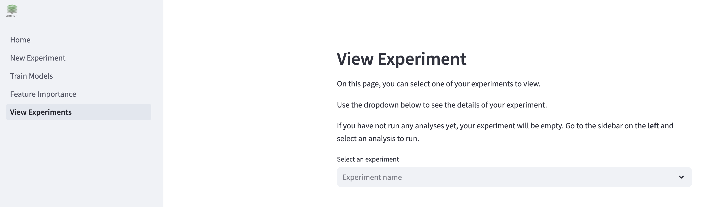
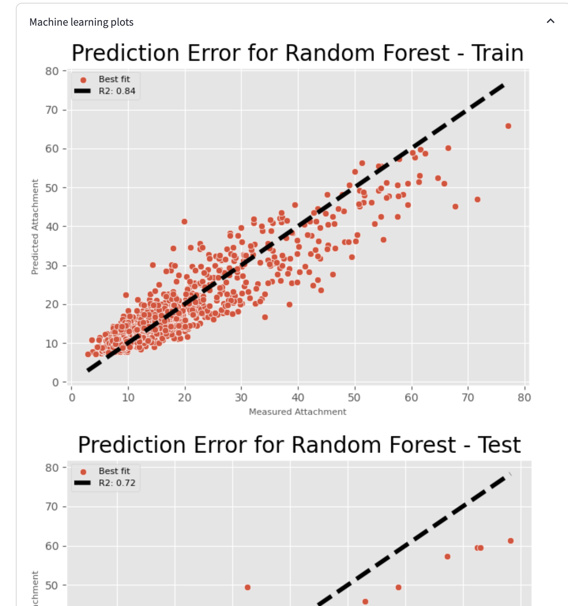
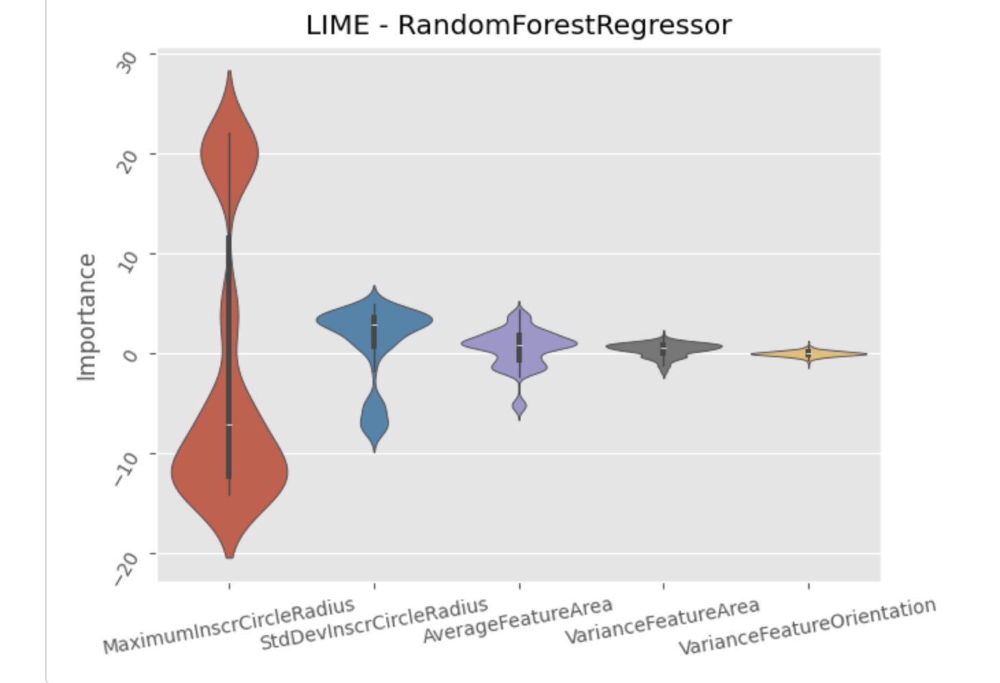
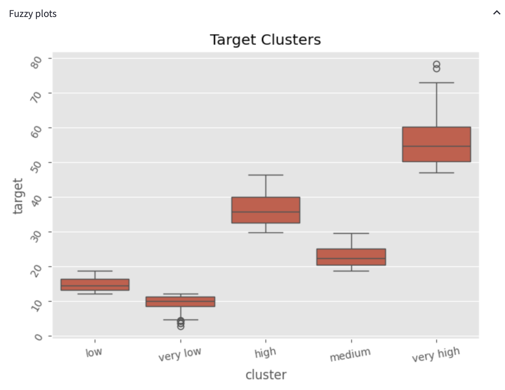

# View experiments
You can view the outputs of your experiments by clicking **"View Experiments"** on the left hand side of the page.

To view an experiment, select one from the dropdown menu. Any outputs generated, such as plots and logs, will appear on the screen.

